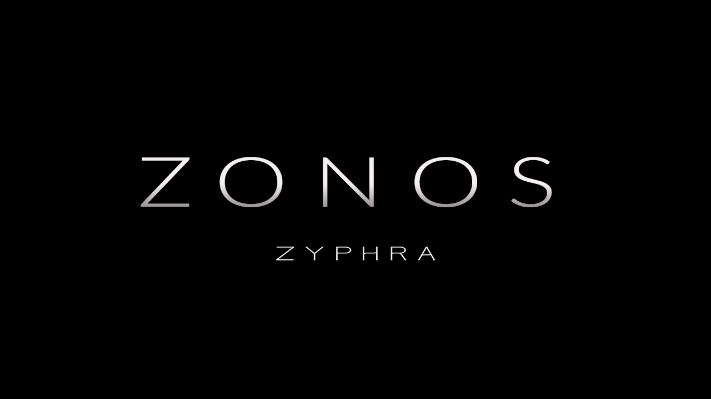

<p align="center" style="margin-bottom:10px;">
    
</p>


<p align="center" style="margin-bottom:40px;">
    
</p>

# <p align="center"> Opensource AI Podcast generator with Voice Cloning </p>

<p align="center"> OpenPodcraft is an open-source project that enables users to create podcasts from their textual content. With OpenPodcraft, you can either clone your own voice or use voices from different individuals to generate professional-sounding podcasts. </p>

<p align="center" style="margin-bottom:40px;">
    
</p>

<!-- <div align="center" style="width:100px;">
   <video src="https://github.com/user-attachments/assets/d0298adc-86e7-499d-a6c4-bf8e3e90025f" style="width:50px;"></video>      
</div>

<div align="center" style="width:100px;">
   <video src="https://github.com/user-attachments/assets/c6f34a0b-ac60-43be-b1ac-11556986f0cc" style="width:50px;"></video>      
</div> -->

## Featured Podcasts Samples
Listen to a samples generated by Open Podcraft

- Sample 1
<div align="center" style="width:100px;">
   <video src="https://github.com/user-attachments/assets/7bc4d91e-b00e-41c2-9cb4-acad90909859" style="width:50px;"></video>      
</div>

## 🚀 Features

- 🎙️ **Clone your own voice** – Create a digital version of your voice for podcasts.  
- 🗣️ **Use voices from other speakers** – Choose from a variety of AI-generated voices.  
- 📜 **Generate transcript using different LLM APIs** – Leverage multiple AI models for accurate transcription.  
- 💻 **Cross-compatible with different OS** – Works seamlessly on Windows, Mac, and Linux.  


## Installation

1. **Install Docker** 
    - Make sure you have Docker installed on your system (Linux, Windows, or Mac).
    - Links: [Linux](https://docs.docker.com/engine/install/ubuntu/) | [Windows](https://docs.docker.com/desktop/setup/install/windows-install/) | [Mac](https://docs.docker.com/desktop/setup/install/mac-install/)

2. **Setup OpenRouter API key** 
    - Setup API key manually
    ```sh
    # Navigate to the project directory
    cd open-podcraft

    # create .env file and add the keys as follows
    OPENROUTER_API_KEY=<here-goes-your-api-key>
    ```

    - Use Python to setup the API key
    ```sh
    # Navigate to the project directory
    cd open-podcraft

    # run the py script and follow the instructions
    python set_api_key.py
    ```


3. **Install and run the app** 

    ```sh
    # Clone the repository
    git clone https://github.com/vaishanth-rmrj/open-podcraft.git

    # Navigate to the project directory
    cd open-podcraft

    # Start the Docker container
    docker-compose up -d 

    # Run the application inside the container
    docker exec -it cont-open-podcraft python app.py
    ```

## Customization
- Add your custom audio speech files (.wav or .mp3) to `/static/voice/custom`
- If you want to change the LLM prompting for the  script you can edit: `assets/prompts.yaml`. (Will make it available in the GUI soon)
- To change the TTS speech generation params you can edit: `configs/default.py`. (Will make it available in the GUI soon)

## Open Source Stack

Open Podcraft is built on top of many wonderful open-source libraries!

[](https://www.python.org)
[](https://fastapi.tiangolo.com)
[](https://svelte.dev)
[](https://getbootstrap.com/)
[](https://github.com/Zyphra/Zonos)

## Contribution

Contributions are welcome! Feel free to fork the repository and create pull requests.

## Issues

If you have any problem running the app, create a new issue and I will try to fix it asap.

## License

This project is licensed under the Apache 2.0 License - see the [LICENSE](LICENSE) file for details.

